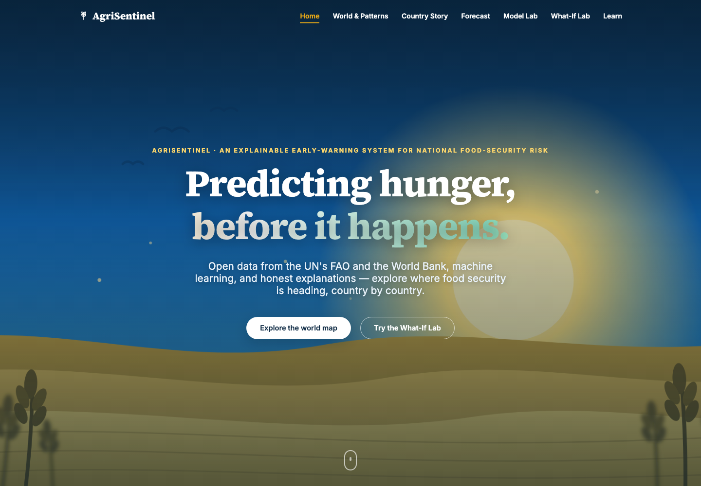
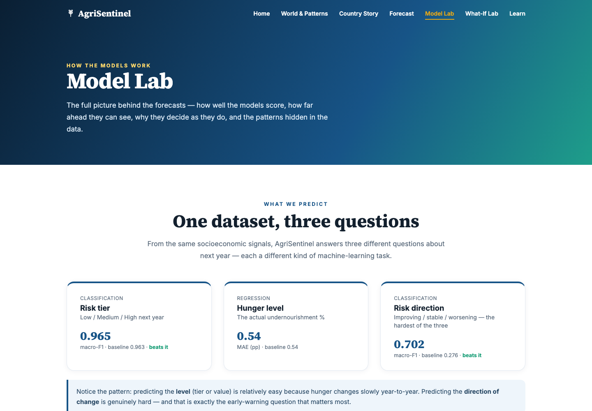
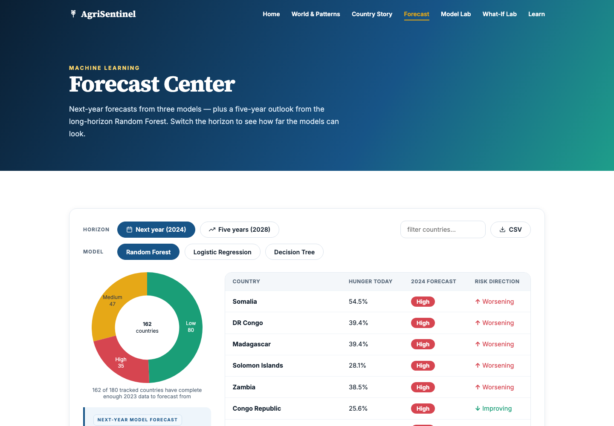
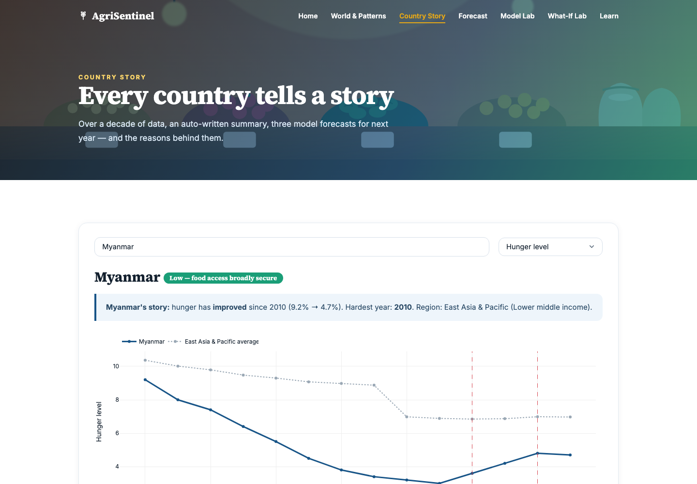
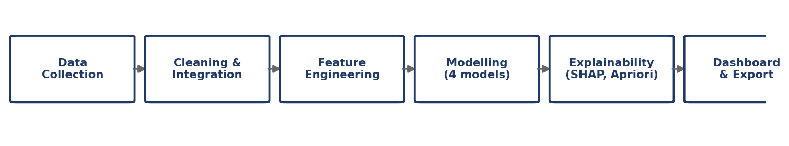

<p align="center">
  
</p>

<h1 align="center">AgriSentinel</h1>

<p align="center">
  <strong>An explainable early-warning system for national food-security risk.</strong><br>
  Predicts a country's risk tier 1 and 5 years ahead — and shows its working.
</p>

<p align="center">
  <a href="https://predictagrisentinel.netlify.app/"></a>
</p>

<p align="center">
  <a href="https://github.com/ssettlynn/AgriSentinel/actions/workflows/tests.yml"></a>
  
  
  
  
  
  <a href="LICENSE"></a>
</p>

---

## Contents

- [What it does](#what-it-does)
- [Live dashboard](#live-dashboard)
- [Results](#results)
- [Architecture — one engine, three front ends](#architecture--one-engine-three-front-ends)
- [Quick start](#quick-start)
- [Project structure](#project-structure)
- [Data](#data)
- [Design rules this codebase enforces](#design-rules-this-codebase-enforces)
- [Testing](#testing)
- [Known limitations](#known-limitations)
- [Report, citation and license](#report-citation-and-license)

---

## What it does

AgriSentinel places every country in a food-security risk tier — **Low**, **Medium** or
**High** — at two horizons, **one year** and **five years** ahead, and explains each
prediction with SHAP rather than asking to be trusted.

It is built on open data: FAOSTAT food-security and nutrition indicators joined to World
Bank economic indicators, covering **180 countries over 2010–2023**. The train,
validation and test splits are strictly **chronological**, so the model is only ever
scored on years it has never seen and no future information can leak backwards.

One design choice drives everything else. This is an *early-warning* system, so a missed
High-risk country costs far more than a false alarm. That asymmetry is why the project
reports the **F₂ score** beside macro-F1, why it sweeps the **misclassification cost**
explicitly instead of accepting a default, and why the headline check is not accuracy but
*"was any High-risk country ever called Low-risk?"*

## Live dashboard

### → **https://predictagrisentinel.netlify.app/**

No installation and no login. Every number on every page is read from a generated data
file — nothing is hand-typed into the HTML.

<p align="center">
  
  
</p>
<p align="center">
  
  
</p>

| Page | What it shows |
| --- | --- |
| [Home](https://predictagrisentinel.netlify.app/) | Global risk map and headline numbers |
| [Model Lab](https://predictagrisentinel.netlify.app/modellab.html) | Scoreboard, **F₂ comparison**, **class-weight sweep** |
| [Forecast](https://predictagrisentinel.netlify.app/forecast.html) | 1-year and 5-year projections |
| [Explore](https://predictagrisentinel.netlify.app/explore.html) | Country and region explorer |
| [Country](https://predictagrisentinel.netlify.app/country.html) | Per-country drill-down with SHAP |
| [Descriptive](https://predictagrisentinel.netlify.app/descriptive.html) | Dataset statistics |
| [Learn](https://predictagrisentinel.netlify.app/learn.html) | The methods in plain language |

## Results

All figures below are on the **held-out test set** — years the models never saw
(2020–2022 for the one-year horizon, 2017–2018 for five years).

### Risk tier

| Horizon | Model | Macro-F1 | High recall | High F₂ |
| --- | --- | --- | --- | --- |
| 1 year | Persistence *(baseline)* | 0.963 | 0.963 | 0.965 |
| 1 year | Logistic Regression | 0.956 | **0.991** | **0.984** |
| 1 year | Decision Tree | 0.947 | 0.954 | 0.949 |
| 1 year | **Random Forest** | **0.965** | 0.963 | 0.965 |
| 5 years | Persistence *(baseline)* | 0.823 | 0.761 | 0.778 |
| 5 years | Logistic Regression | 0.833 | 0.789 | 0.805 |
| 5 years | Decision Tree | 0.842 | 0.775 | 0.797 |
| 5 years | **Random Forest** | **0.865** | **0.803** | **0.826** |

> **No High-risk country was ever labelled Low-risk on the test set** — the one error an
> early-warning system cannot afford.

### The metric changes the answer

Macro-F1 treats a false alarm and a missed warning as equally bad. F₂ weights recall twice
as heavily, which is closer to what this system actually costs its user — and the ranking
flips:

| 1-year horizon | Macro-F1 | High-tier F₂ |
| --- | --- | --- |
| Random Forest | **0.965** 🥇 | 0.965 |
| Logistic Regression | 0.956 | **0.984** 🥇 |

If catching every at-risk country were the only goal, the *simpler* model would be the
better choice. Reporting only macro-F1 would have hidden that entirely.

### How much should a missed warning weigh?

Rather than accept `class_weight="balanced"` as a default, the cost is swept explicitly
across **none / balanced / High×2 / High×3 / High×5**, scored on **validation** only —
the weight is a modelling choice, so scoring it on test would be exactly the leak the
rest of the project avoids.

Model families respond very differently. Logistic Regression traces a clean trade-off
curve and peaks at **High×2 (F₂ = 0.997)**, trading precision 1.000 → 0.958 for recall
0.956 → 1.000. Random Forest barely moves at all: its High recall stays pinned at 0.941
whatever the weight, because a deep forest on a well-separated signal is already
confident. That is a result, not a failure, and it is reported as one.

### Secondary tasks

| Task | Model | Score | Baseline |
| --- | --- | --- | --- |
| Risk direction — 1 year | Random Forest | macro-F1 **0.702** | 0.276 |
| Hunger level (PoU) — 1 year | Random Forest | MAE **0.54 pp**, R² **0.99** | MAE 0.54 |
| Hunger level (PoU) — 5 years | Random Forest | MAE **2.12 pp**, R² **0.88** | MAE 2.12 |

### Where prediction stops working

Five-year **inflation** is not predictable from this feature set: **R² = −0.27**, worse
than simply carrying the last value forward. It is kept in the results rather than quietly
dropped, because an early-warning system that hides its blind spots is worse than one that
names them.

## Architecture — one engine, three front ends

<p align="center">
  
</p>

The Colab notebook, the command-line pipeline and the website all call the **same**
`src/agrisentinel/` package. None of them re-implements cleaning, feature engineering,
modelling or export — there is no second copy of any of that logic anywhere in the repo.

| | Notebook | Terminal / PyCharm | Website |
| --- | --- | --- | --- |
| Entry point | `notebooks/agrisentinel_pipeline.ipynb` | `python scripts/run_pipeline.py` | `site/index.html` |
| Purpose | teaching depth — every step shown and charted | production — same result, no notebook | presentation |
| Logic | imports `src/agrisentinel` | imports `src/agrisentinel` | reads the file `dashboard_export.py` writes |

Fix a bug in `src/agrisentinel/cleaning.py` and all three are fixed at once.

## Quick start

```bash
git clone https://github.com/ssettlynn/AgriSentinel.git
cd AgriSentinel
python3 -m venv .venv && source .venv/bin/activate
pip install -e ".[dev]"
```

Then:

```bash
pytest tests/ -q                    # 22 tests
python scripts/run_pipeline.py -v   # collect → clean → statistics → mine_rules → train → export
python scripts/serve_site.py        # browse the dashboard at localhost
```

That pipeline command reproduces **every number in the project** — the master panel, the
trained models, the evaluation metrics and `site/agrisentinel_data.js` — from the pinned
data snapshot recorded in `config/settings.yaml`.

Run one stage at a time while developing:

```bash
python scripts/run_pipeline.py --list-stages
python scripts/run_pipeline.py --stage clean
```

A `Makefile` wraps the same commands: `make install`, `make test`, `make pipeline`,
`make site`, `make clean`.

### In Google Colab

Open `notebooks/agrisentinel_pipeline.ipynb` in
[Colab](https://colab.research.google.com/) and choose *Runtime → Run all*. **Step 0.1**
locates the project (mount Drive or `git clone` this repo); **Step 0.2** installs only the
few libraries Colab does not already ship. The F₂ comparison is **Step 8.1b** and the
class-weight sweep is **Step 8.1c**.

## Project structure

```
AgriSentinel/
├── config/                        the ONLY place any path or run parameter is defined
│   ├── paths.py                     Python constants, imported everywhere
│   ├── schema.json                  language-agnostic mirror, kept in sync by tests/
│   ├── settings.py                  loader with validation
│   └── settings.yaml                year range, split years, hyperparameters, pinned snapshot
├── data/
│   ├── raw/                       pinned, checksummed snapshots (committed — a few MB)
│   └── interim/, processed/       regenerable, gitignored
├── src/agrisentinel/              THE pipeline — imported by the notebook and the scripts
│   ├── collection.py                snapshot-pinned downloads
│   ├── cleaning.py                  ISO3 mapping, merges, missing-data rules
│   ├── features.py                  targets, chronological splits, Apriori transactions
│   ├── statistics.py                descriptive report, significance tests, normality
│   ├── modeling.py                  classifiers, regressors, F-beta, class-weight sweep,
│   │                                threshold tuning, bootstrap CIs, OLS
│   ├── explainability.py            SHAP values and Apriori rule mining
│   └── dashboard_export.py          THE single writer of site/agrisentinel_data.js
├── scripts/
│   ├── run_pipeline.py            desktop entry point, zero duplicated logic
│   └── serve_site.py              local static server for site/
├── notebooks/
│   └── agrisentinel_pipeline.ipynb  the teaching / report notebook (106 cells)
├── site/                          static dashboard — reads only agrisentinel_data.js
├── tests/                         22 tests, several of them regression tests for real bugs
├── docs/
│   ├── AgriSentinel_Project_Book.pdf  the full written report
│   └── assets/                    screenshots and diagrams used by this README
├── models/, reports/              regenerable, gitignored
├── Makefile, pyproject.toml, requirements.txt, netlify.toml
└── .github/workflows/tests.yml    CI: pytest on every push
```

## Data

Both sources are open data, redistributed here only so the analysis is reproducible from a
fresh clone.

| Source | Indicators | Licence |
| --- | --- | --- |
| [FAOSTAT Food Security and Nutrition Indicators](https://www.fao.org/faostat/en/#data/FS) | prevalence of undernourishment, dietary energy supply adequacy, cereal import dependency, food production variability | CC BY-NC-SA 3.0 IGO |
| [World Bank WDI](https://data.worldbank.org/) | GDP per capita, GDP growth, inflation (CPI), population growth, region and income group | CC BY 4.0 |

Each snapshot lives in `data/raw/<source>/<date>/` beside a `manifest.json` recording the
download date, source URL and file size. The FAOSTAT bulk file is committed as the ~2 MB
zip it ships as; its ~50 MB extracted form is a build artifact and is gitignored.

Downstream, `master_dataset.csv` carries a companion `*_filled` column for every
indicator — `0` where the value was reported and `1` where it was imputed — so no chart
can quietly present an imputed value as an observation.

## Design rules this codebase enforces

Each of these traces to a specific bug hit while building the project, not to hypothetical
caution.

1. **No numeric literal describing a result may appear in the UI.** Every displayed number
   is read from `site/agrisentinel_data.js`, generated by `dashboard_export.py`.
2. **One pipeline, one place.** The notebook and the desktop project both call
   `src/agrisentinel/` — never a re-typed copy.
3. **Every raw dataset is pinned.** `manifest.json` records a checksum and row count, and
   the pipeline refuses to silently substitute "latest" for a pinned snapshot — FAOSTAT
   revises its bulk file in place with no version number of its own.
4. **Every category mapping has a tested override table.** `"China, Taiwan Province of"`
   matches two ISO3 codes and returns a *list* if handled naively; `"Southern Africa"`
   silently resolves to `ZAF`. `tests/test_cleaning.py` is a permanent regression test for
   both.
5. **All paths come from `config/paths.py`.** No file spells out a path as a string
   literal a second time.
6. **`config/paths.py` and `config/schema.json` cannot silently drift.**
   `tests/test_paths_schema_sync.py` proves it — run against a deliberately broken schema
   during development, it caught the break immediately with the exact diff.

## Testing

```bash
pytest tests/ -q     # 22 passed
```

| File | Tests | Covers |
| --- | --- | --- |
| `test_paths_schema_sync.py` | 5 | config ↔ schema sync, with a proven drift-detection demo |
| `test_cleaning.py` | 5 | ISO3 edge cases — the Taiwan-list bug, the Southern-Africa mis-match |
| `test_features.py` | 3 | a real regression: NaN comparisons evaluating to `False` rather than `NaN`, which broke Apriori's mutual-exclusivity guarantee |
| `test_stat_addons.py` | 9 | significance tests, correlation gap, normality, imbalance and flag ablation, OLS, and the F-beta / class-weight contracts — including that β = 1 reproduces macro-F1 exactly |

CI runs the suite on every push and pull request.

## Known limitations

- **Documented non-determinism.** `RandomForestClassifier(n_jobs=-1)` aggregates trees in
  parallel, so probability outputs can differ by ~0.001 between runs on identical data —
  thread-order-dependent floating-point summation, not a logic bug. It never changes a
  reported tier, direction or rounded metric. Forcing `n_jobs=1` would remove it at a real
  performance cost for no practical benefit, so it is documented rather than "fixed".
- **Five-year inflation is not predictable** from this feature set (R² = −0.27). See
  [Where prediction stops working](#where-prediction-stops-working).
- **The one-year task is nearly saturated.** Persistence already scores macro-F1 0.963, so
  the models' one-year gain is small by construction. The five-year horizon is where the
  learned models genuinely separate from the baseline (0.865 vs 0.823).
- **Country coverage varies by year.** Countries missing an indicator for a given year are
  imputed and flagged, never silently dropped — but the imputation rate is higher in the
  earliest years of the panel.

## Report, citation and license

The full written report — methodology, exploratory analysis, results and discussion — is
in [`docs/AgriSentinel_Project_Book.pdf`](docs/AgriSentinel_Project_Book.pdf).

Built by **Soe Sett Lynn** for **IS-212 Data and Knowledge Mining**, B.C.Sc., University of
Computer Studies (Yangon). If you use this work, `CITATION.cff` has the citation metadata.

Code is released under the [MIT License](LICENSE). The redistributed datasets are **not**
covered by it — they remain the property of FAO and the World Bank under their own
licences, set out in [`NOTICE`](NOTICE). Please cite the original publishers when using
the data.
